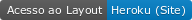
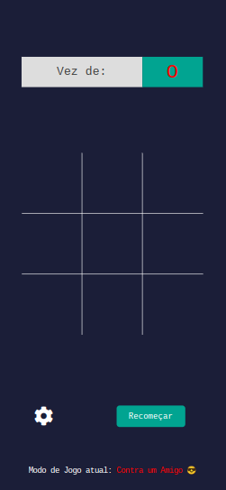
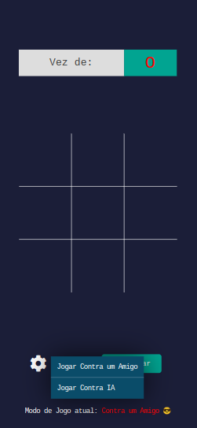
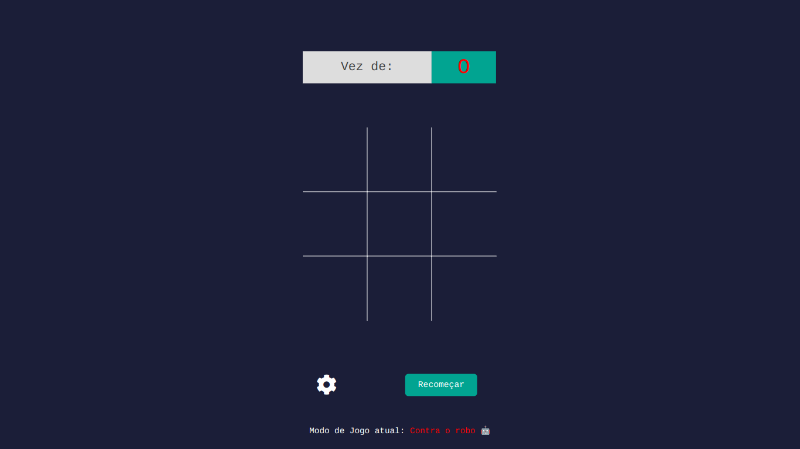
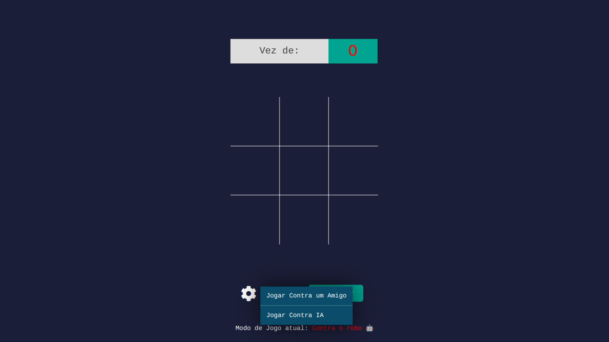

<p align="center">
    
</p>

------------------------------------
## Índice

* [Sobre](#sobre)
* [Funcionalidades](#funcionalidades)
* [Layout](#layout)
* [Como Executar](#como-executar)
* [Tecnologias](#tecnologias)
* [Autor](#autor)
* [Licença](#licenca)
* <a href="https://jogo-da-velha-saulo.herokuapp.com/" target="_blank">#️⃣ Jogo da Velha (Tic-tac-toe) ---- Concluído ✅ ----</a>

------------------------------------

## 💻 Sobre <a id="sobre"></a>
 
#️⃣ O clássico Jogo da velha construído inteiramente em reactJS com opção de jogar contra um amigo ou jogar contra o robô.
<br>

------------------------------------

## ⚙️ Funcionalidades <a id="funcionalidades"></a>
1. ✅ Responsividade
2. ✅ Design e animações
3. ✅ Jogar sozinho (contra um robô)
4. ✅ Jogar com um amigo
5. ✅ Pequenas funcionalidades que ajudam na jogatina

------------------------------------

## 🎨 Layout <a id="layout"></a>

<a href="https://jogo-da-velha-saulo.herokuapp.com/"></a>
<p>*O Layout completo do site está disponível na <a href="https://jogo-da-velha-saulo.herokuapp.com/">Heroku</a></p>

<h3>Mobile (web)</h3>
<p align="center">
    
    
</p>

<h3>Desktop (web)</h3>




------------------------------------

## 🧩 Como Executar <a id="como-executar"></a>

Há duas formas de executar o projeto:

* Instalando as dependencias
```
# Clone o repositório
$ git clone https://github.com/Saulo-Felipe/TicTacToe.git

# Em seguida
$ yarn install

$ yarn dev
```

* Create react-app
```
# Crie o diretorio do react-app
$ yarn create react-app 

# Clone o repositório
$ git clone https://github.com/Saulo-Felipe/TicTacToe.git

# Mova os arquivos para a pasta do react-app

$ yarn start
```

------------------------------------

## 🤖 Tecnologias <a id="tecnologias"></a>

Neste simples app, foram utilizadas as seguintes tecnologias: 

* React </img>
* HTML5 </img>
* CSS3 </img>
* Javascript </img>

------------------------------------

## 👨 Autor <a id="autor"></a>

<p align="center">➡️ Criado e desenvolvido por <strong>eu</strong> mesmo 🧑‍💻.</p>

------------------------------------

## 📜 Licença <a id="licenca"></a>

<p align="center">Todos os direitos reservados ©Copyright - Saulo Felipe</p>